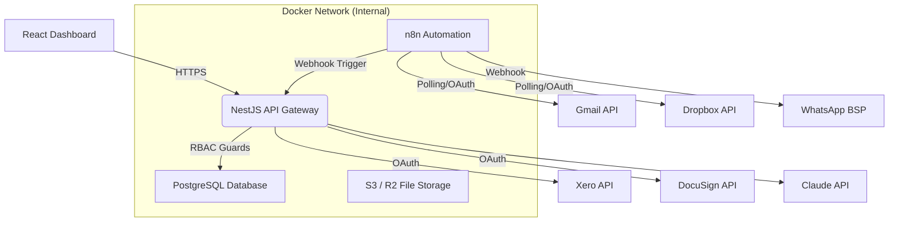

# 🏗️ ICARO PROJECTS: Construction Operations Platform

> This file is a reference document for AI coding assistants (Claude Code, Cursor, Copilot, etc.) working in this repository. Read it fully before making architectural decisions or writing code that touches security, RBAC, or financial data.

**Status:** Active Development (Phase 1)
**Last Updated:** 2026-07-23
**Client:** Rob (Icaro Projects)
**Developer:** Arjay
**Tech Stack:** TypeScript, NestJS, React, PostgreSQL, Prisma, n8n, Docker, Claude API
**Frontend Repo Note:** This repository currently contains **frontend-only** code (React + Vite + TS + Tailwind v4). The NestJS backend described in §4 and §5 Roadmap is **unbuilt** and will live in a separate repository. The frontend targets the API contract described in this document; until the backend lands, it runs on in-memory seed data + a Supabase auth scaffolding layer. See `ARCHITECTURE.md` for the frontend's folder structure and `PROGRESS.md` for what is implemented today.

---

## Stakeholders

| Person | Role |
|---|---|
| Rob | Client / product owner (Icaro Projects) |
| Maria | Handles manual uploads (RAMS/Method Statements) alongside Rob in MVP |
| Arjay | Developer |

---

## 1. Non-Negotiable Engineering Tenets

These override convenience or speed in every decision:

1. **Security-First:** Never trust the frontend. RBAC enforced server-side on every endpoint. Encrypt all OAuth tokens at rest. Immutable audit logs for financial mutations.
2. **Dockerized Development:** The entire stack (Postgres, NestJS, n8n) must run via `docker-compose up` for 100% environment parity.
3. **Modular Architecture:** Domain-driven design via NestJS modules. Keep Xero/DocuSign integrations isolated in dedicated modules.
4. **Code Best Practices:** Strict TypeScript, NestJS Pipes/Guards/Interceptors, separation of concerns (Controller → Service → Repository).
5. **Fail-Safe Design:** Every endpoint validates inputs via `class-validator` DTOs. Treat Gmail/WhatsApp parser output as untrusted input, always.

---

## 2. Architecture



---

## 3. Tech Stack & Docker Services

| Service | Technology | Docker Image | Port (Dev) |
|---|---|---|---|
| Backend API | NestJS (Node.js + TS) | `node:20-alpine` (custom build) | 3000 |
| Database | PostgreSQL 16 | `postgres:16-alpine` | 5432 |
| Automation | n8n (self-hosted, community) | `n8nio/n8n:latest` | 5678 |
| Caching (future) | Redis (dashboard aggregations) | `redis:7-alpine` | 6379 |
| Frontend | React + Vite + TS | `nginx:alpine` (build output) | 80 |

---

## 4. Repository Structure

```
src/
├── modules/
│   ├── auth/             # Clerk/Auth0, Guards, Decorators
│   ├── users/             # CRUD for users, RBAC logic
│   ├── projects/          # Projects, Variations, RFIs
│   ├── tenders/           # Tender register
│   ├── suppliers/         # Subcontractor directory & compliance
│   ├── integrations/
│   │   ├── xero/
│   │   ├── docusign/
│   │   └── ai/            # Claude API wrapper
│   └── automation/        # Webhook handlers for n8n
├── common/
│   ├── database/          # Prisma service
│   ├── interceptors/      # AuditLogInterceptor
│   ├── pipes/             # Custom validation pipes
│   └── dto/               # Shared DTOs (Pagination, etc.)
└── main.ts
```

---

## 5. Roadmap

### Phase 1 — Core MVP (4-6 weeks)
Goal: team uses the platform for day-to-day project tracking. Manual data entry only — no external integrations yet, but full CRUD + edge cases baked in.

**Milestone 1 — Infrastructure & Setup**

| Task | Details |
|---|---|
| ☐ Docker Compose Setup | `docker-compose.yml` linking NestJS, Postgres, n8n. Persistent volumes for DB data. |
| ☐ Prisma Schema Definition | `schema.prisma` with `tenantId` (multi-tenancy ready) and `is_deleted` (soft delete) on relevant tables. |
| ☐ CI/CD Pipeline | GitHub Actions: `npm run build`, `npm run test`, Docker build on PRs to `main`. |
| ☐ Auth & RBAC Guard | Clerk/Auth0 integration + custom `RolesGuard` rejecting requests where role (Admin/Estimator/PM) doesn't match endpoint metadata. |
| ☐ Immutable Audit Log | `AuditLog` table + Interceptor auto-capturing `userId`, `action`, `before`, `after` on all financial endpoints. |

**Milestone 2 — Core Business Logic** (CRUD + soft-delete + edge cases required for every module)

| Module | CRUD | Edge Cases |
|---|---|---|
| Tender Register | Create (manual), Read (filter/status), Update (status), Delete (soft-delete + restore) | Block deletion if `is_signed = true`. Auto-alert if due date < 3 days. |
| Supplier Directory | Create, Read (filter/trade), Update, Delete (archive + restore) | "Merge" function to combine duplicate suppliers without losing historical project links. |
| Project Variations | Create, Read, Update (Pending/Approved/Rejected), Delete (locked if sent to DocuSign) | If "Rejected", require `rejection_reason` input. |
| Brain Dump | Create, Read (active list), Update (mark done), Delete (archive) | Reassignable to a specific Project ID or User ID. |
| Team Permissions | Create, Read, Update (role change), Delete (deactivate) | Block removal if user has open Tenders — force reassignment via API helper. |

**Milestone 3 — Frontend UI** (built against approved mockups)

| Task | Details |
|---|---|
| ☐ Dashboard Shell | Cash at Risk, CEO Action List, Brain Dump Input, Waiting on Client widgets. |
| ☐ Tender Register UI | Table with Status filter + "Show Won/Lost" toggle. |
| ☐ Supplier Directory UI | Grid card layout with Trade tags + "Add Supplier" modal. |
| ☐ Project View UI | Variations tab — render VAR-001, VAR-002 with Approved/Pending/Rejected tags + summary footer. |

### Phase 2 — External Integrations & Automation (Month 2-3)
Goal: live financials, e-signatures, Dropbox sync. Security is paramount here.

| Task | Details |
|---|---|
| ☐ n8n Container Deployment | Same internal Docker network as NestJS API for internal webhooks. |
| ☐ Xero OAuth Service | `XeroService` storing encrypted refresh/access tokens in Postgres; Cron job refreshes expired tokens. |
| ☐ Xero Webhook Handler | `POST /integrations/xero/webhook`. Must validate webhook signature before processing. |
| ☐ DocuSign API Integration | Generate PDF of a Variation, trigger DocuSign envelope. `@Roles(Admin)` guard — subcontractors cannot initiate variations. |
| ☐ Dropbox Read-Only Sync | n8n polls Dropbox; new drawings POST to NestJS to log a revision in Snagging/RFIs. |

### Phase 3 & 4 — AI & Communications Layer (Month 3-5)
Goal: AI parsing, email management, WhatsApp integration.

| Task | Details |
|---|---|
| ☐ Claude API Wrapper | `AiService` accepting an input string, returning `AiParsedResponse` (Client, Scope, Due Date). |
| ☐ Gmail Tender Parser | n8n watches Gmail → NestJS → Claude API → structured data → draft Tender created in DB. |
| ☐ WhatsApp Hub | Via Twilio/360dialog BSP. Inbound webhook → classifier checks for ProjectId → logs to Project Timeline. |
| ☐ AI Data Retention Policy | Cron job auto-deletes raw message transcripts after X days (GDPR/UK privacy compliance). |

---

## 6. Security & Infrastructure Rules (Must Follow)

**Docker**
- Never run containers as root — use the `node` user in the NestJS Dockerfile.
- Always define `healthcheck` in `docker-compose.yml`.
- Postgres and n8n stay on the internal Docker network only. Never expose port 5432 publicly — only NestJS (3000) and n8n (5678).

**API & RBAC (server-side only)**
- `@Roles()` decorator on every controller method, e.g. `@Roles(Role.Admin)` on `DELETE /api/suppliers/:id`.
- Every POST/PUT uses `class-validator` DTOs.
- Reject unexpected fields — `whitelist: true` in the global `ValidationPipe`.
- Never store refresh tokens in cookies — encrypt via NestJS's `EncryptionService` before saving to Postgres.

---

## 7. Pre-Launch Audit Checklist (Phase 1 gate before handing to Rob)

| Check | Action Required |
|---|---|
| ☐ Data Validation | `class-validator` throws if a PM POSTs a Variation with a negative Value. |
| ☐ Financial Privacy | Fetch a Tender as Estimator role — `contract_sum` must return `null`/be hidden. |
| ☐ Snagging File Upload | `multer`/`FileInterceptor` restricts to `.jpg`, `.png`, `.heic`, < 10MB. |
| ☐ Docker Clean-up | `docker-compose down -v` does not delete bind-mounted volume data. |
| ☐ Audit Log Integrity | Create → approve → delete a variation. `AuditLog` shows who deleted it and the pre-deletion value. |

---

## 8. Ask, Don't Assume

These are open and unresolved — an AI agent should flag them rather than silently pick an answer:

- **Granola Plan:** Phase 4 notes sync requires Granola's Enterprise Plan. If Rob is on Standard, this feature is skipped.
- **WhatsApp Outbound:** Undecided whether the system sends automated outbound replies to subs (e.g. "Your insurance is expiring") or only does inbound sorting. Affects Twilio/360dialog cost.
- **Subcontractor Portal:** Undecided whether subs get login access, or Rob/Maria continue to manually upload RAMS/Method Statements. MVP currently assumes manual upload.

---

## 9. Decision Log

| Date | Decision |
|---|---|
| 2026-07-17 | Chose NestJS over Express — built-in Guards (RBAC) and Interceptors (audit log). |
| 2026-07-19 | Chose Docker over direct VPS installs — guarantees dev matches prod exactly. |
| 2026-07-21 | Hard-enforced soft-delete (`is_deleted` column + Prisma middleware) over physical `DELETE`, so the CEO can restore accidentally deleted Tenders. |

---

## 10. Frontend Repository Status (2026-07-23)

This section describes what the frontend repo at `project-bolt-sb1-jqbyvg82/project` contains today. It **adds** to the architecture spec in §4 (which describes the planned NestJS backend). The two are intended to live in separate repos — the frontend imports an API contract that the backend fulfils.

### 10.1 Tech reality in this repo

- **React 18 + Vite 5 + TypeScript 5** (strict mode, `noImplicitAny`)
- **Tailwind CSS v4** (CSS-first config via `@tailwindcss/vite` — no `tailwind.config.js`, no `postcss.config.js`). Tokens declared as `@theme` in `src/index.css`; see `DESIGN.md` §2 for the design-token mapping.
- **Supabase JS** (`@supabase/supabase-js`) used for auth scaffolding only — no DB/queries wired yet. A typed `supabaseClient` + `AuthProvider` + magic-link `LoginPage` live in `src/lib/auth/`. If `VITE_SUPABASE_URL`/`VITE_SUPABASE_ANON_KEY` are unset, the app boots in **demo admin mode**.
- **RBAC context** (`src/lib/rbac/`) — typed `Role = 'admin' | 'estimator' | 'pm'`, `Permissions` for the 8 modules, `usePermission(module)` hook, `RequireAuth` / `RequirePermission` guards. **Source of truth remains the NestJS backend per §6** — this is UX-layer only.
- **zod** added for client-side form validation, mirroring the intent of the backend's `class-validator` DTOs (per §5 "Fail-Safe Design").

### 10.2 Folder structure (authoritative — see `ARCHITECTURE.md` for detail)

The flat `src/components/*` layout was replaced with a **feature-sliced** structure that maps 1:1 to the planned NestJS modules in §4:

```
src/
├── features/                  # One folder per domain
│   ├── dashboard/             # Widget grid + add/remove + resize
│   ├── tenders/               # Tender register + zod validation
│   ├── suppliers/             # Supplier directory + zod validation
│   ├── settings/              # Company / Integrations / Team & Perms / Financials
│   └── projects/             # Project detail + variations tab
├── shared/                    # Cross-feature primitives
│   ├── components/ui/        # Pill, Button, Input, Select, Modal, Toast, Card
│   ├── components/layout/    # Sidebar, AppShell, PageHeader
│   ├── data/                  # projects.ts (single source of truth)
│   └── lib/                   # format utils
├── lib/                       # Whole-app concerns
│   ├── auth/                  # supabaseClient, AuthContext, LoginPage
│   └── rbac/                  # RbacContext, types, usePermission
└── App.tsx                    # Route switch + auth gate
```

### 10.3 Milestone 3 (Frontend UI) status — started early

Per §5 Roadmap, Phase 1 Milestone 3 (Frontend UI) requires the screens below. They've been **built ahead of the backend** in this repo, against in-memory seed data, so Rob can see and feel the product before API integration:

| Screen | Status | Backend dependency to wire later |
|---|---|---|
| Dashboard shell (`/`) | ✅ Built — 12-col grid, add/remove/resize widgets, undo-on-delete | Persisted per-user layout (currently in-memory) |
| Tender Register (`/tenders`) | ✅ Built — table + mobile cards, status dropdown, soft-delete + restore, due-soon vs overdue badges | `GET/POST/PUT/DELETE /api/tenders` |
| Suppliers Directory (`/suppliers`) | ✅ Built — card grid, trade filter, archive + restore | `GET/POST/PUT/DELETE /api/suppliers` |
| Settings (`/settings`) | ✅ Built — Company, Integrations, Team & Permissions, Financials | `GET/PUT /api/settings`, `GET/POST/PUT/DELETE /api/members` |
| Project Detail → Variations (`/projects/:id/variations`) | ✅ Built — header, tab bar, variations table with summary footer | `GET /api/projects/:id`, `GET /api/projects/:id/variations` |
| Other project tabs (RFIs, Procurement, …) | ⏳ Placeholder only — reuses Variations table pattern when data is tabular | Per-module endpoints, see §5 Roadmap |

### 10.4 Frontend security posture (additive to §6)

PROJECT.md §6 remains the authority. The frontend adds the following **defense-in-depth** layers, all of which assume the backend re-validates:

| Concern | Frontend layer | Backend remains authoritative |
|---|---|---|
| Authentication | Supabase magic-link via `AuthProvider` (gates `App.tsx`) | Backend verifies JWT on every request |
| RBAC | `usePermission(module)` + `RequirePermission` route guards hide/disabled UI | `@Roles()` decorator + `RolesGuard` on every controller |
| Input validation | `zod` schemas at form submit (NewTender, AddSupplier) | `class-validator` DTOs with `whitelist: true` |
| Negative-value guard | `newTenderSchema.min(0)` rejects negative `contractSum` client-side | Backend DTO re-validates — per §7 audit checklist |
| XSS | No `dangerouslySetInnerHTML` anywhere; all input renders as text | Backend sanitizes user content before storage |
| Audit log | Not yet surfaced in UI — flagged in `ARCHITECTURE.md` §5 as a Phase 2 task | `AuditLogInterceptor` per §6 |

### 10.5 Dev workflow for this repo

```bash
npm install          # install deps
npm run typecheck    # tsc --noEmit
npm run lint         # eslint
npm run build        # vite build → dist/
npm run dev          # vite — boots at localhost:5173
```

When the backend lands, copy `.env.example` → `.env.local` and set `VITE_SUPABASE_URL`/`VITE_SUPABASE_ANON_KEY`. Until then, the app silently logs a warning and routes everything to a demo admin session so the UI is explorable locally.
